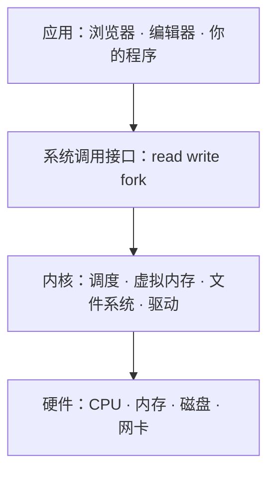
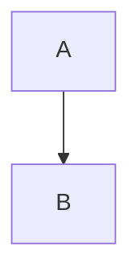
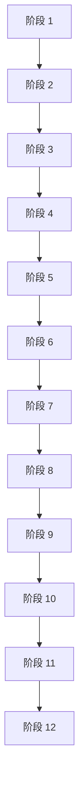

# Mermaid 行内预览

## 截图中的流程图

```mermaid
flowchart TD
    A["应用：浏览器 · 编辑器 · 你的程序"] --> B["系统调用接口：read write fork"]
    B --> C["内核：调度 · 虚拟内存 · 文件系统 · 驱动"]
    C --> D["硬件：CPU · 内存 · 磁盘 · 网卡"]
```

## 横向小图

```mermaid
flowchart LR
    A --> B
```

## 纵向小图

```mermaid
flowchart TD
    A --> B
```

## 横向大图

```mermaid
flowchart LR
    A[阶段 1] --> B[阶段 2] --> C[阶段 3] --> D[阶段 4]
    D --> E[阶段 5] --> F[阶段 6] --> G[阶段 7] --> H[阶段 8]
    H --> I[阶段 9] --> J[阶段 10] --> K[阶段 11] --> L[阶段 12]
```

## 纵向大图

```mermaid
flowchart TD
    A[阶段 1] --> B[阶段 2] --> C[阶段 3] --> D[阶段 4]
    D --> E[阶段 5] --> F[阶段 6] --> G[阶段 7] --> H[阶段 8]
    H --> I[阶段 9] --> J[阶段 10] --> K[阶段 11] --> L[阶段 12]
```
